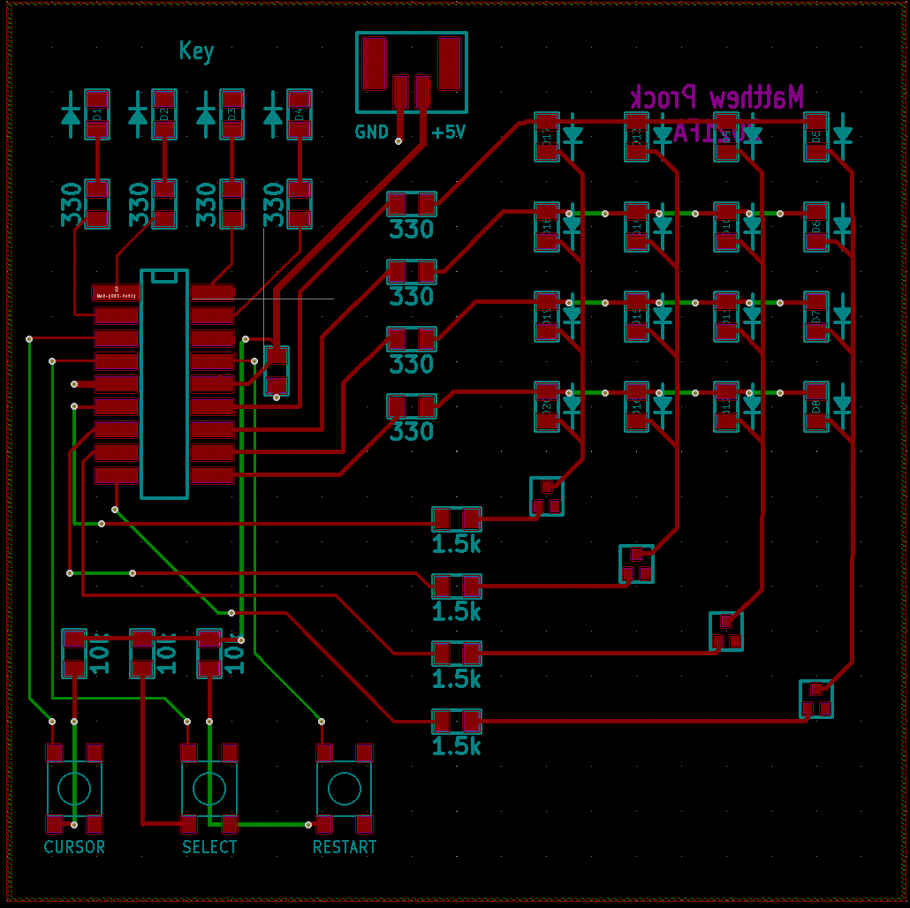
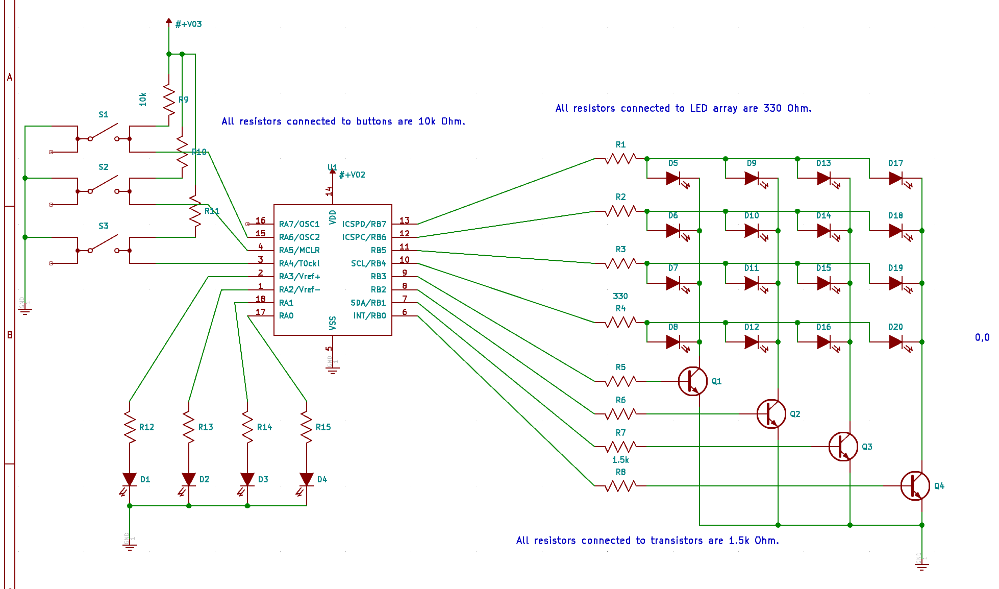
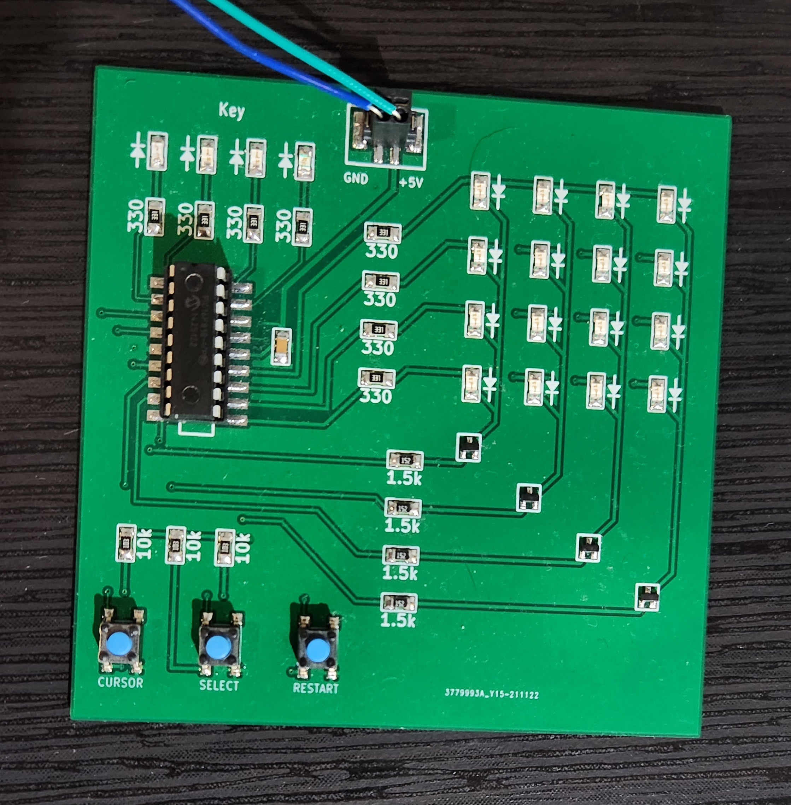

# PIC Parity Bit Error Detection Game

A PIC16F818 microcontroller-based educational game that teaches error detection using Hamming code parity bits through an interactive LED matrix display.

## Project Overview

This project implements a 4x4 LED grid game where players must identify and correct single-bit errors in transmitted data using parity bits. The system displays random data with intentional errors, and players use buttons to select and correct the flipped bit. 

I was inspired to make the project by [this excellant video](https://youtu.be/wTJI_WuZSwE?si=To3kZnW4QarjRsSB) by 3Blue1Brown on youtube.  Its really good, you should go watch it, its way better than my boring assembly code. 


### Key Features
- 4x4 LED matrix displaying random data patterns
- 4 parity bit indicators showing error detection codes
- Interactive button controls for bit selection and confirmation
- Visual feedback for correct/incorrect solutions
- Random number generation for varied gameplay

## Game Mechanics

1. **Display**: A 4x4 grid shows random on/off LEDs representing transmitted data
2. **Parity Bits**: 4 LEDs indicate parity for different bit groupings:
   - Bit 0: Columns 1 and 3 parity
   - Bit 1: Columns 2 and 4 parity  
   - Bit 2: Rows 1 and 3 parity
   - Bit 3: Rows 2 and 4 parity
3. **Objective**: Identify which bit in the 4x4 grid has been flipped
4. **Controls**:
   - Selection button: Cycle through grid positions (current selection blinks)
   - Confirm button: Lock in selection and check answer
   - Reset button: Generate new puzzle

### Feedback System
- **Correct Answer**: Diagonal checkmark animation on grid, all parity bits flash
- **Wrong Answer**: X pattern on grid, parity bits alternate

## Hardware

### Components
- **Microcontroller**: PIC16F818
- **Display**: 4x4 LED matrix + 4 parity indicator LEDs
- **Input**: 3 push buttons (select, confirm, reset)
- **Power**: Standard 5V supply

### Circuit Design
- Custom PCB design created in KiCad
- Surface-mount components for compact design
- ICSP programming header for development


*Custom PCB layout showing component placement and routing*

 
*Circuit schematic with PIC16F818 microcontroller and LED matrix*


*Final assembled PCB showing the completed hardware*

## Software

### Architecture
- **Language**: PIC Assembly (MPASM)
- **Random Number Generator**: X-ABC algorithm implementation
- **Interrupt Handling**: Button debouncing and timing
- **Display Control**: LED matrix multiplexing
- **Game Logic**: Hamming code parity calculation and verification

### Key Technical Challenges

#### Interrupt-Driven Display Multiplexing
The most complex aspect was implementing precise timer interrupt handling for LED matrix control:

- **8-bit Timer Interrupt**: With only an 8-bit timer, careful cycle counting was required to utilize the interrupt effectively 
- **Manual Context Switching**: PIC16F818 has no automatic stack - all register preservation (W, STATUS, FSR) must be handled manually in the ISR
- **Dual Display Timing**: The interrupt cycles through two 4x4 display boards, using an 8-pin indexing system
- **Memory Architecture**: 4 bytes per board (8 total), with MSB controlling row transistors and 4 LSBs selecting column LEDs
- **Persistence of Vision**: Timer frequency tuned so LEDs appear continuously lit despite sequential scanning
- **Input Responsiveness**: ISR timing balanced to maintain button polling responsiveness - if interrupts run too long, user input is missed

This required hours of timing analysis and empirical tuning to achieve both visual persistence and real-time user interaction.

#### Bit-by-Bit Board Traversal Edge Cases
The scan_routine implements a complex state machine for traversing the 4x4 board one bit at a time, with several critical edge cases:

- **Bit Position Tracking**: BITCOUNTER (0-3) tracks position within each row, while BITCHECK holds the actual bit mask being shifted left via `rlf` to traverse columns
- **Row Boundary Detection**: When BITCOUNTER reaches 4 (checked via `btfsc BITCOUNTER,2`), the end_row routine handles:
  - XORing the last bit of the current row
  - Incrementing FSR to move to the next row
  - Resetting BITCOUNTER to 0 and BITCHECK to 0x18 for the next row
- **Special First Bit Handling**: When BITCOUNTER is 0 (start of row), a different literal is XORed with the COPY board due to the boundary with the column bits 
- **ROWCHECK Wraparound**: ROWCHECK tracks the current row (0x24-0x27 for BOARDCPY), with bit 3 tested to detect when all 4 rows are complete, triggering a reset to the first row
- **Debounce Timing**: Each button press includes a delay (0xC0) to prevent multiple triggers from a single press while maintaining responsiveness

This state machine allows users to select any single bit in the 4x4 grid despite having only one selection button, by cycling through all 16 positions sequentially.

#### Automatic Board Swapping via Timer Interrupt
The system implements an elegant visual effect where two boards (BOARDPTR and BOARDCPY) are "automagically" swapped at human-visible intervals:

- **Timer-Driven Display**: TMR0 overflow triggers the interrupt service routine, which calls `display_both`
- **Asymmetric Display Timing**: 
  - BOARDPTR displays for 16 iterations (4 LEDs × 4 rows × 255 delay cycles)
  - BOARDCPY displays for 64 iterations (4× longer) to emphasize the modified state
  - This creates a visual "blink" effect where changes are clearly visible
- **Memory Layout**: Two consecutive 4-byte blocks in RAM:
  - BOARDPTR (0x20-0x23): Original puzzle state
  - BOARDCPY (0x24-0x27): User-modified state with bit flips
- **Multiplexed Column Driving**: PORTB drives transistor bases with patterns 0x08, 0x04, 0x02, 0x01 to enable each column sequentially
- **Human Persistence of Vision**: Cycling through all positions (faster than ~30Hz) makes both boards appear simultaneously lit with the modified bits appearing to blink

## Project Structure

```
├── hardware/
│   ├── pcb/              # KiCad PCB files
│   ├── schematics/       # Schematic designs
│   ├── gerbers/          # Manufacturing files
│   └── libraries/        # Custom component libraries
├── software/
│   ├── src/              # PIC assembly source code
├── docs/
│   ├── images/           # Project photos and screenshots
│   ├── datasheets/       # Component specifications
│   └── Final_Project_Idea.txt  # Original project concept
└── manufacturing/        # Production files
```


## License

This project is open source and available for educational use. The random number generator algorithm is freely available but not suitable for cryptographic applications.

---

*Developed as a final project demonstrating embedded systems design, PCB layout, and error detection algorithms.*
